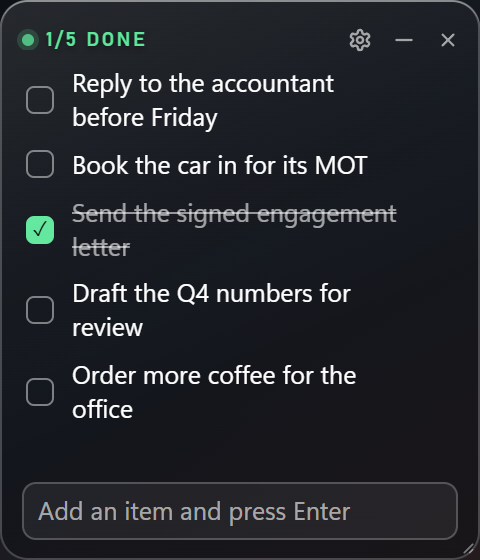
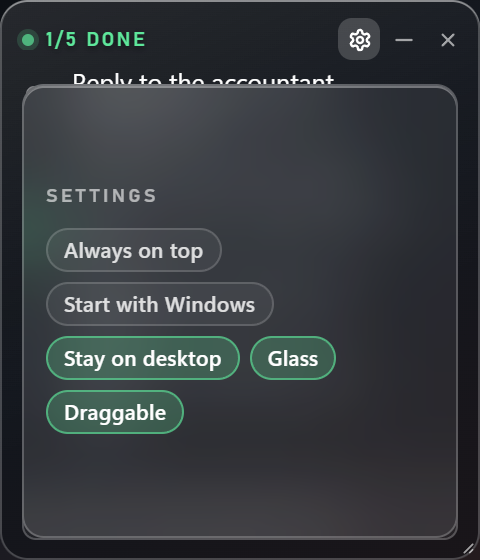

# Simple Notes Widget

A small always-on-top Windows sticky note with a checklist. Tick an item and it is
struck through.





## Features

- **Click an item to tick it** — it strikes through and dims. Click it again to un-tick.
- **Type and press Enter** to add an item. **×** (shown on hover) deletes one.
- The note is saved to `notes.json` beside the widget and loaded again on start.
- **Drag the header strip** to move it and the **bottom-right corner** to resize, so the
  text stays selectable and the add field stays typeable.
- Glass card: colourless, blurred over the desktop, white text. The mint accent is used
  for exactly one thing — the tick on a finished item.
- **Stays on the desktop**: visible through show desktop (Win+D or the three-finger
  swipe), and back below your windows when the desktop is dismissed.
- **Draggable** lock (settings sheet and tray) locks moving and resizing; the checklist
  keeps working, so a parked note is still usable.
- Tray: new item, show / hide, always on top, start with Windows, stay on desktop,
  draggable, quit. Its tooltip reads `n/m done`.
- Handles the dull cases: an empty note says so, long text wraps, and there are caps of
  200 items and 400 characters per item.

## Run

```powershell
python -m venv .venv
.venv\Scripts\python.exe -m pip install -r requirements.txt
run.cmd
```

No account, no network, nothing to configure. `run-debug.cmd` starts it with a console
window if you want to see errors.

## Commands

```powershell
.venv\Scripts\python.exe app.py --self-check    # environment and what is on the note
.venv\Scripts\python.exe app.py --state         # the card payload as JSON
.venv\Scripts\python.exe -m unittest discover -s tests -t .    # 19 tests, no widgets
```

## Files

```
notes.py     the checklist: add, tick, edit, delete; atomic saves to notes.json
app.py       window host: glass, native drag and resize, tray, the desktop pin
ui/          card, settings sheet, renderer
tools/       window captures, a real-mouse input probe, Z-order and desktop probes
tests/       the checklist logic with no widgets involved
```

Sibling widgets, same shell and same behaviour:
[deepseek-peaktime-monitor-widget](https://github.com/Hamras47/deepseek-peaktime-monitor-widget)
and [Deepseek-Wallet-Balance-widget](https://github.com/Hamras47/Deepseek-Wallet-Balance-widget).
